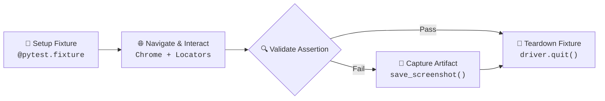
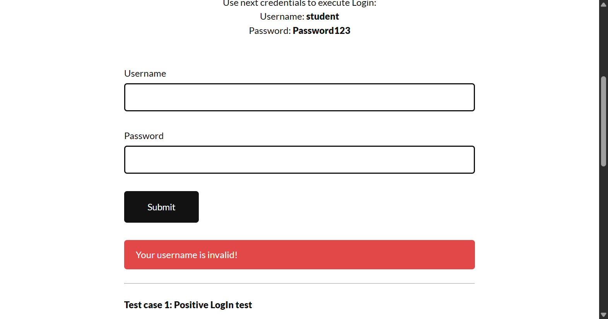

# Web UI Automation Test Suite

<div align="center">

<a href="https://git.io/typing-svg">
  
</a>

<p align="center">
  
  
  
  
  
</p>

<p align="center">
  <b>A functional UI test automation suite built with Python, Selenium WebDriver, and Pytest.</b><br/>
  Validates authentication workflows, dynamic element searches, complex form controls, and automated failure screenshot capture.
</p>

</div>

---

## 📊 Test Suite Dashboard

<div align="center">

| 🧪 Total Scenarios | ✅ Passed | ❌ Failed | ⚡ Pass Rate | ⏱️ Execution Time | 🌐 Target Engine |
| :---: | :---: | :---: | :---: | :---: | :---: |
| **4** | **4** | **0** | **100%** | **~33s** | **Google Chrome** |

</div>

<br/>

| Test Module | Test Scenario | Target Web Application | Key Validation / Assertions | Result |
| :--- | :--- | :--- | :--- | :---: |
| `tests/test_login.py` | **Valid Authentication** | DemoQA Login | Credentials dispatch, submission trigger, and session state inspection (`current_url`, `title`). | `PASSED` |
| `tests/test_invalid.py` | **Negative Login Validation** | Practice Test Automation | Submits erroneous credentials, validates error message banner, and triggers failure screenshot upon assertion failure. | `PASSED` |
| `tests/test_search.py` | **Product Search & Filtering** | Amazon India | Sends search query, executes submission, and verifies `"Results"` presence in page source. | `PASSED` |
| `tests/test_form.py` | **Complex Form Submission** | DemoQA Practice Form | Populates text fields, handles radio buttons and checkboxes via JavaScript executor clicks, and asserts confirmation modal (`"Thanks for submitting the form"`). | `PASSED` |

---

## 📌 Project Overview

This project is a functional test automation suite designed to validate core user workflows across live web applications. Built using **Python**, **Selenium WebDriver**, and **Pytest**, it demonstrates industry-standard automation patterns:

- **Isolated Browser Lifecycles**: Every test receives a clean Chrome WebDriver instance managed via Pytest generator fixtures (`yield`).
- **Resilient UI Interactions**: Combines native Selenium locator actions with JavaScript execution (`browser.execute_script`) for elements obstructed by custom overlays or pseudo-elements.
- **Positive & Negative Assertions**: Tests both standard user paths and negative validation states (e.g., verifying error banners for invalid credentials).
- **Automated Failure Artifacts**: Exception-intercepting screenshot captures that automatically persist viewport snapshots for rapid debugging during test failures.

---

## 🔄 Automation Workflow Architecture



1. **Initialization**: Pytest invokes the `browser` fixture, spinning up a fresh Chrome WebDriver session with an implicit wait timeout (10 seconds) to accommodate DOM rendering.
2. **Execution**: The test navigates to the target URL, locates target elements using robust locator strategies (`By.ID`, `By.XPATH`), and dispatches inputs or JavaScript-assisted clicks.
3. **Verification**: Live DOM state is validated against expected business logic using standard Python assertions.
4. **Failure Capture**: If an assertion error is raised in the negative test suite, the failure block executes `browser.save_screenshot()` before re-raising the exception for Pytest reporting.
5. **Clean Teardown**: The fixture reaches its post-`yield` teardown phase to release system resources:
   - `driver.close()` closes the current browser window/tab.
   - `driver.quit()` closes the entire WebDriver session and all associated windows.

---

## 📁 Project Structure

```text
P-1_Web_Automation_test/
├── screenshots/
│   └── login_failed1.png       # Test failure screenshot capture artifact
├── tests/
│   ├── test_form.py            # Practice form input & JS click validation
│   ├── test_invalid.py         # Negative login flow with screenshot trigger
│   ├── test_login.py           # Standard login interaction test
│   └── test_search.py          # E-commerce search flow & results assertion
└── README.md                   # Project documentation
```

---

## 🛠️ Technologies & Tools

- **Programming Language**: Python
- **Automation Framework**: Selenium WebDriver
- **Test Runner**: Pytest
- **Browser Automation**: Google Chrome / ChromeDriver
- **Interaction Helpers**: JavaScript Executor (`execute_script`)

---

## 📸 Failure Debugging & Screenshot Capture

To facilitate rapid defect triage, negative assertion flows include failure-capturing logic that captures and saves the viewport state:

```python
try:
    assert "Your username is invalid!" in browser.page_source
except AssertionError:
    browser.save_screenshot("../screenshots/login_failed1.png")
    raise
```

### Captured Failure Evidence
The following screenshot artifact illustrates the viewport capture during test failure triage:

<div align="center">
  
</div>

---

## 🚀 How to Run the Tests

### 1. Prerequisites
Ensure Python and Google Chrome are installed:
```bash
python --version
```

### 2. Install Dependencies
```bash
pip install selenium pytest
```

### 3. Run the Full Suite
Execute all test cases with verbose output:
```bash
pytest tests/ -v
```

<details>
<summary><b>⚙️ View Commands for Individual Test Modules</b></summary>

```bash
# Run valid authentication test
pytest tests/test_login.py -v

# Run negative login validation
pytest tests/test_invalid.py -v

# Run product search test
pytest tests/test_search.py -v

# Run complex form submission test
pytest tests/test_form.py -v
```

</details>

---

## 📈 Test Execution Output

<details open>
<summary><b>🧪 Pytest Verbose Execution Terminal Output</b></summary>

```terminal
============================= test session starts =============================
platform win32 -- Python 3.11.3, pytest-9.1.1, pluggy-1.6.0
cachedir: .pytest_cache
rootdir: C:\QA engineer Journey\QA-Engineer_journey\P-1_Web_Automation_test
plugins: anyio-4.12.1
collected 4 items

tests/test_form.py::test_form PASSED                                     [ 25%]
tests/test_invalid.py::test_invalid_login PASSED                         [ 50%]
tests/test_login.py::test_login PASSED                                   [ 75%]
tests/test_search.py::test_search PASSED                                 [100%]

============================= 4 passed in 33.17s ==============================
```

</details>

---

## 🧠 Core QA Competencies Demonstrated

- **Web UI Automation**: End-to-end user journey automation across distinct web applications.
- **Selenium WebDriver**: Browser session management, element discovery, and interaction handling.
- **Pytest Fixture Lifecycle**: Clean setup and teardown routines implemented via generator fixtures (`yield`).
- **Locator Strategy Selection**: Targeted element identification using `By.ID` and custom `By.XPATH` selectors.
- **JavaScript Execution**: Overcoming standard click interception on custom styled elements using `execute_script()`.
- **Negative Testing**: Validating system boundaries and verifying error feedback for incorrect user inputs.
- **Form Automation**: Multi-type data input covering text fields, email formats, mobile numbers, radio buttons, and checkboxes.
- **Failure Artifact Serialization**: Intercepting assertion errors and persisting viewport screenshots for defect diagnosis.

---

## 🔮 Future Improvements *(Roadmap)*

The following architecture enhancements are planned for subsequent iterations:

- [ ] **Page Object Model (POM)**: Abstract locators and page interactions into dedicated page classes to enhance maintainability and reduce test code coupling.
- [ ] **Explicit Waits (`WebDriverWait`)**: Migrate implicit waits to targeted `expected_conditions` (e.g., `visibility_of_element_located`, `element_to_be_clickable`) to optimize execution speed and stability.
- [ ] **Visual Test Reporting**: Integrate `pytest-html` or Allure Reports for rich dashboards containing execution trends, durations, and attached failure media.
- [ ] **CI/CD Pipeline Integration**: Configure GitHub Actions workflows to execute tests in headless mode automatically on repository commits and pull requests.
- [ ] **Cross-Browser Execution**: Parameterize test fixtures to run seamlessly across Firefox, Edge, and headless Chrome.

---

## 👨‍💻 Author

**Shafiq Ahamed**  
*Aspiring QA Automation Engineer / Software Development Engineer in Test (SDET)*  

- Focus: Web UI Automation, Selenium WebDriver, Pytest, Test Framework Design  
- GitHub: [@shafiq-ahamed04](https://github.com/shafiq-ahamed04)
